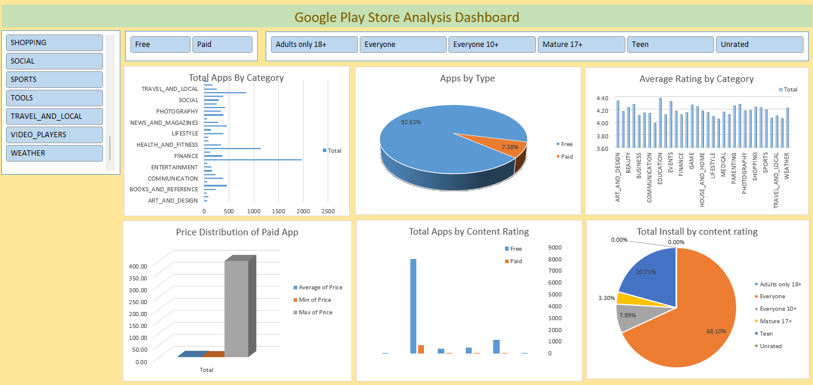

📊 Power BI Google Play Store Dashboard

🚀 Overview
This project provides an interactive Excel dashboard analyzing data from the Google Play Store. It helps visualize key insights such as app ratings, reviews, installs, and category performance.

The dashboard is designed for data-driven decision-making by product managers, marketers, and developers interested in mobile app analytics.

📁 Dataset
The dataset used is a cleaned version of the Google Play Store data, which includes:

App Name

Category

Rating

Reviews

Installs

Type (Free/Paid)

Price

Content Rating

Genres

Last Updated

📸 Dashboard Preview
Overview Page	Category Analysis	Ratings Breakdown

💡 Add your images in an images/ folder inside your project and refer to them like above.

🛠️ How to Use
Clone the repository:

bash
Copy
Edit
git clone https://github.com/NencyLaheri/PowerBI-GooglePlayStore-Dashboard.git
Open the .xlsx file in Excel.

Ensure your dataset is located in the correct folder or connect to the source.

Interact with the visualizations to explore insights.

🔍 Features
App category and rating distribution

Free vs paid app analysis

User review trends

Install base segmentation

📦 Tools Used
Power BI Desktop

Python (optional, for preprocessing)

CSV Dataset

🖼️ Screenshots
Include screenshots like so:

markdown
Copy
Edit

📄 License
This project is licensed under the MIT License.

🙌 Acknowledgements
Google Play Store Dataset from Kaggle

